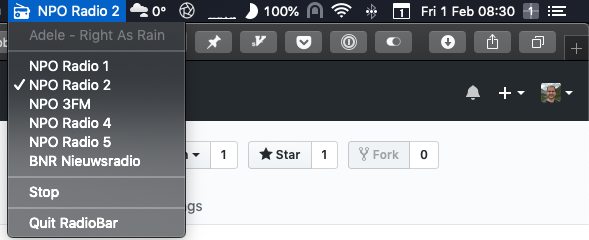

## RadioBar

macOS menubar app to play user-defined radio stations with help from [rumps](https://github.com/jaredks/rumps) and VLC. It includes a `remote` to switch channels, on/off, pause/resume etc. Forked from [RadioBar](https://github.com/wass3r/RadioBar) by [David May](https://github.com/wass3r)

## Features

- **Lightweight and fast!**
- **Menubar only, no Dock icon**
- **Add any streaming URL that VLC can play**
- **Stop playing when macOS goes to sleep**
- **Remote control via scripts and launchers such as Alfred**

## Installation

Make sure you have `vlc` installed, e.g. using `brew cask install vlc`. Also, if you don't have Python installed, install it with `brew install python3`.

- Adapt `channels.json` to your needs
- Check the source code to e.g. change notification settings (manual for now)
- Build the `.app` using `python setup.py py2app` (see [Development](#Development))
- Install the `.app` from the `dist/` directory

Currently no packaged `.app` is distributed because I've not yet been able to include an easy way to change / update channels. Suggestions for an easy / simple mechanism are welcome!

## Usage

- Click a channel to start streaming (a ✔ is shown in front)
- Click the current channel to pause streaming (a `-` is shown in front)
- Click "Stop" to stop streaming a channel
- "Now Playing" information shows on top of the menu
- Notifications are show when the "Now playing" information changes (unless it's the channel / show name)

Pause / resume stops streaming (but shows the channel as paused). It's not buffering radio (which didn't seem logical for live radio). You can also use the `remote.py` to automate switching channels, see below.

When macOS sleeps streaming will be stopped and you have to manually resume it (this is a feature). This only works if you're using an updated version of `rumps` (see [PR #109](https://github.com/jaredks/rumps/pull/109)).

## Remote

Use the include `remote.py` to send commands to a running RadioBar instance to change channels and switch on/off. You can also use the command as part of an Alfred workflow. `remote.py` understands the following commands:

- `n` - switch to channel _n_ in your list (starting at 1) - start playing if stopped
- `off` - stop playing raudio
- `pause` - pause playing radio (don't switch station, but stop streaming)
- `resume` | `on` - resume playing radio (start streaming again)
- `nowplaying` - output the now playing info 
- `show` - output the now playing info and trigger a notification

## Development

Make sure you have VLC installed, ie. `brew cask install vlc`.

Tested in Python 2.7.x and 3.x. To run, try:

1. `pip install -r requirements.txt`
2. `python radiobar.py`

To re-build the macOS app, run:

1. `rm -rf ./dist/ ./build/`
2. `python setup.py py2app`

## Bugs

- "Now playing" integration is experimental and might not work as expected

- Sleep / wake only works when using a [patched version](https://github.com/mdbraber/rumps) of `rumps` until [PR #109](https://github.com/jaredks/rumps/pull/109) gets merged.

- `parse_with_options` might not not be needing the second argument (`timeout`) in your version. You could remove it (not sure yet if it makes any difference). I'm still trying to implement a hook that watches for metadata changes for now playing. Tips welcome :-)

- To use it with the current VLC (>= 3.x) we need to preload the `libvlccore.dylib` as a workaround. See 
https://github.com/oaubert/python-vlc/issues/37 for more info.

## Credits

This is a fork of RadioBar built by [wass3r](https://github.com/wass3r/RadioBar/) (David May). All credits for the intial concept go to him!

## License
MIT
